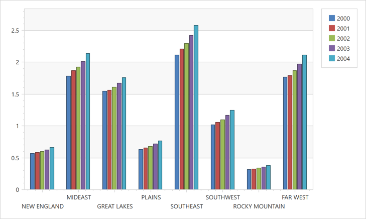

<!-- default file list -->
*Files to look at*:

* [MainWindow.xaml](./CS/Charts_Lesson4/MainWindow.xaml)
<!-- default file list end -->
# Chart for WPF - Getting Started - Lesson 3 - Use a Series Template for Auto-Created Series

This lesson shows how to add a series template to a chart's diagram, and then automatically bind this template to a data source.

Note that although in this tutorial you will use the **Microsoft Access** database (.mdb), the ChartControl can be bound to a variety of other data providers.

## Documentation

* [Lesson 3 - Use a Series Template for Auto-Created Series](https://docs.devexpress.com/WPF/9758/controls-and-libraries/charts-suite/chart-control/getting-started/lesson-3-use-a-series-template-for-auto-created-series)
* [Provide Data](https://docs.devexpress.com/WPF/6854/controls-and-libraries/charts-suite/chart-control/provide-data/provide-data)
* [Chart Element Hierarchy](https://docs.devexpress.com/WPF/6330/controls-and-libraries/charts-suite/chart-control/getting-started/chart-element-hierarchy)
